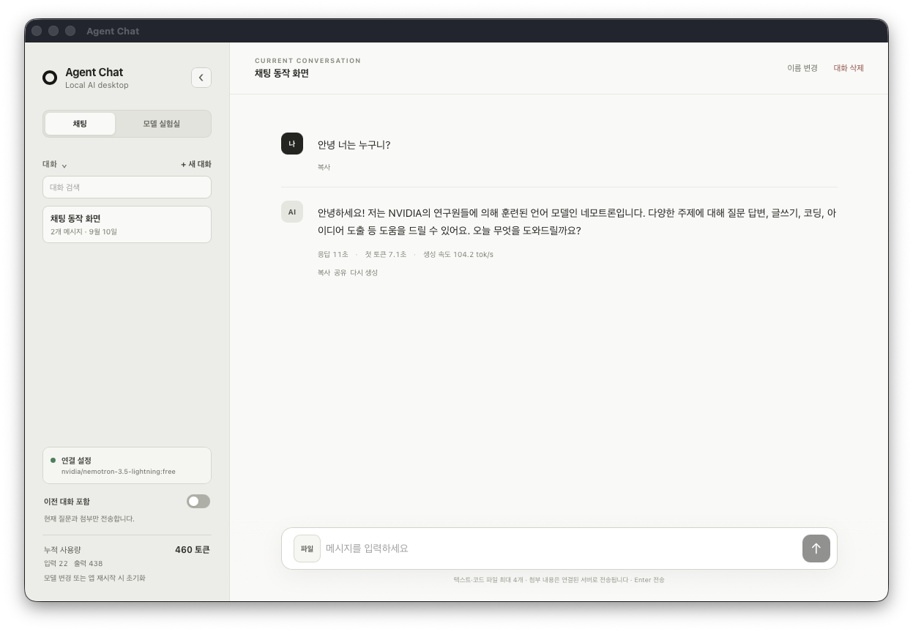
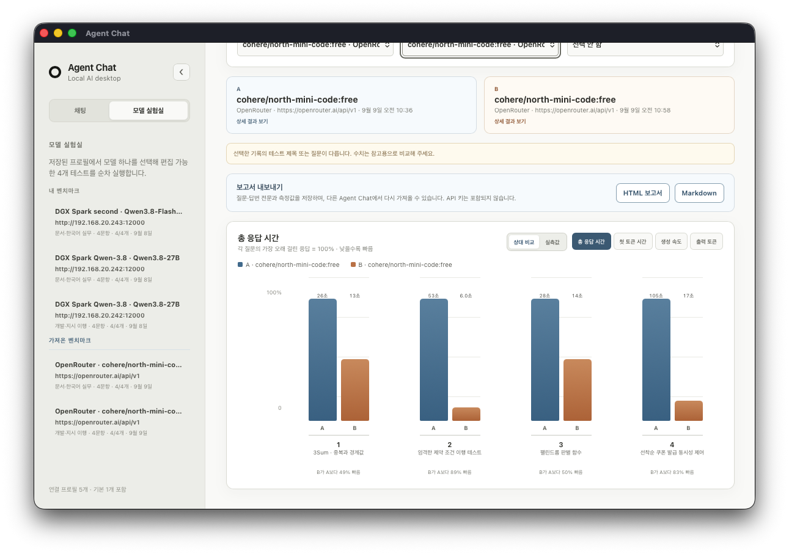

# Agent Chat Desktop

로컬 또는 원격의 OpenAI 호환 AI 서버와 연결하는 Wails 데스크톱 채팅 클라이언트입니다. 연결 프로필, 문서 첨부, 모델 벤치마크와 결과 비교를 제공합니다.

## 주요 기능

- OpenAI 호환 API·vLLM 서버 연결, 추론 강도 선택과 스트리밍 채팅
- 텍스트·코드·텍스트 기반 PDF·Word(`.docx`)·Excel(`.xlsx`) 첨부 내용을 참고하는 대화
- 긴 문서의 제목·시트·문단 단위 선택과 질문 관련 문맥 전달
- 출력이 이어지는 동안 유지되는 스트리밍 채팅과 생성 중단
- 연결 프로필과 모델별 응답 시간·토큰 사용량 확인
- 질문지 프로필 기반 모델 벤치마크, 누적 결과, 최대 세 기록 비교, 결과 창·분석·비교 화면의 Markdown·HTML 보고서 내보내기와 중복을 제외한 가져오기
- Markdown 기반의 로컬 대화·벤치마크 기록 저장

## 화면 미리보기

### 채팅

### 모델 실험실

## 빠른 시작

소스에서 실행하려면 Git, Go 1.25 이상, Node.js 20.19 이상 또는 22.12 이상이 필요합니다. macOS에는 Xcode Command Line Tools, Linux에는 GTK4·WebKitGTK 6.0 개발 패키지가 추가로 필요합니다.

| 운영체제 | 최초 준비 | 개발 실행 | 빌드 | 빌드 결과 실행 |
|---|---|---|---|---|
| macOS | `./scripts/macos/setup.sh` | `./scripts/macos/dev.sh` | `./scripts/macos/build.sh` | `./scripts/macos/run.sh` |
| Windows PowerShell | `powershell -ExecutionPolicy Bypass -File .\scripts\windows\setup.ps1` | `powershell -ExecutionPolicy Bypass -File .\scripts\windows\dev.ps1` | `powershell -ExecutionPolicy Bypass -File .\scripts\windows\build.ps1` | `powershell -ExecutionPolicy Bypass -File .\scripts\windows\run.ps1` |
| Linux | `./scripts/linux/setup.sh` | `./scripts/linux/dev.sh` | `./scripts/linux/build.sh` | `./scripts/linux/run.sh` |

macOS에서 DMG를 만들려면 `./scripts/macos/build.sh --dmg`를 사용합니다. Linux에서 설치 패키지까지 만들려면 `./scripts/linux/build.sh --package`, Windows에서 NSIS 설치 프로그램을 만들려면 `powershell -ExecutionPolicy Bypass -File .\scripts\windows\build.ps1 -Package`를 사용하세요.

스크립트는 프로젝트에 필요한 Wails CLI와 프런트엔드 의존성을 준비하고 환경을 검사합니다. 시스템 도구는 임의로 설치하지 않으며, 빠진 항목과 설치 방법을 알려 줍니다.

## 에이전트에게 맡길 때

에이전트로 설치·빌드·실행 작업을 맡기는 경우 다음 파일을 먼저 읽도록 지시하세요.

> `docs/agent-setup.md`

이 문서에는 운영체제별 필수 도구, 권한이 필요한 설치 작업, 스크립트 사용 순서, 검증 방법과 자주 발생하는 문제의 해결 절차가 정리되어 있습니다.

## 문서

- [에이전트 설치·빌드 안내](docs/agent-setup.md)
- [상세 아키텍처](docs/architecture.md)
- [개발 진행 현황](docs/progress.md)

## 로컬 AI 서버 연결

1. vLLM 등 OpenAI 호환 API 서버를 실행합니다.
2. 앱에서 서버 URL과 필요한 경우 API 키를 입력합니다.
3. **모델 불러오기**로 모델을 선택합니다.
4. 채팅을 시작하거나 **모델 실험실**에서 저장된 연결 프로필로 벤치마크를 실행합니다.

대화와 벤치마크 결과는 사용자 설정 폴더에 Markdown 파일로 저장됩니다. API 키는 저장하지 않습니다. 벤치마크 보고서를 다시 가져오면 같은 결과는 저장하지 않고, 여러 결과 중 새 결과만 추가합니다.

완료된 **벤치마크 결과** 창의 오른쪽 위 **내보내기** 메뉴에서 HTML 보고서 또는 Markdown을 바로 저장할 수 있습니다. 모델 실험실 홈의 기록 분석·기록 비교 화면에서도 같은 형식으로 내보낼 수 있습니다. 기본 파일명은 환경 이름을 제외하고 다음처럼 구성합니다. 파일 시스템에서 허용하지 않는 문자는 공백으로 바꿉니다.

- 단일 결과: `benchmark_[모델]__[추론 강도]__[질문지].[html|md]`
- 두 기록 비교: `benchmark_[A 모델]_vs_1other__[추론 강도]__[질문지].[html|md]`
- 세 기록 비교: `benchmark_[A 모델]_vs_2others__[추론 강도]__[질문지].[html|md]`

추론 강도는 `r-auto`, `r-none`, `r-minimal`, `r-low`, `r-medium`, `r-high`, `r-xhigh`, `r-max`로 표시합니다. 비교하는 기록의 추론 강도가 서로 다르면 `r-mixed`를 사용합니다.

채팅 왼쪽 사이드바의 **이전 대화 포함**은 앱을 시작할 때 기본으로 꺼져 있습니다. 꺼져 있으면 현재 질문과 첨부만 전송하고, 켜면 같은 대화의 이전 질문·답변과 저장된 첨부 텍스트도 함께 전송합니다. 다시 생성에도 현재 스위치 설정을 적용하며, 대화 기록은 설정과 관계없이 유지합니다. 모델 벤치마크는 항상 각 테스트 질문을 독립적으로 전송합니다.

채팅 입력창과 모델 실험실의 **측정할 모델** 아래에서 추론 강도를 선택할 수 있습니다. **자동(서버 기본값)**은 `reasoning_effort`를 전송하지 않으며, 그 밖의 값은 선택한 단계로 전송합니다. `xhigh`와 `max`는 일부 모델·서버에서 지원하지 않을 수 있어 화면에 주의 문구를 표시합니다. 벤치마크에서 사용한 추론 강도는 기록과 내보낸 보고서에 포함됩니다.

**기록 비교**의 A·B·C 기록 선택 목록은 `모델 · 추론 강도 · 연결 프로필 · 질문지 · 실행 시각` 순서로 표시합니다. 추론 강도 정보가 없는 기존 기록은 **자동(서버 기본값)**으로 표시합니다.

채팅 입력창 상단의 **현재 모델 누적**은 서버가 제공한 채팅 입력·출력 토큰을 합산한 값입니다. 모델의 남은 입력 공간을 나타내지는 않으며, 모델을 바꾸거나 앱을 재시작하면 초기화됩니다. 사이드바 오른쪽 위 `‹` 버튼으로 숨기고, 접힌 상태에서는 화면 왼쪽 위 `›` 버튼으로 다시 열 수 있습니다. 사이드바 표시 상태는 저장하지 않습니다.

## 문서 첨부

첨부 파일은 모델에 원본 파일을 전달하지 않습니다. 앱이 로컬에서 읽을 수 있는 텍스트를 추출하고, 질문과 관련된 문서 단위 및 앞뒤 문맥을 골라 모델에 전달합니다. 질문과 관련된 단위를 찾지 못하면 앞부분과 뒷부분 발췌본을 사용합니다. 대화 기록에는 원본이 아니라 실제로 전달한 텍스트만 저장됩니다.

- 지원: 텍스트·코드 파일, 텍스트 기반 PDF, `.docx`, `.xlsx`
- 미지원: 스캔 PDF의 OCR, `.doc`, `.xls`, `.ppt`, `.pptx`
- 한 메시지당 최대 4개, 파일당 5MB, 원본 합계 12MB
- 모델에 전달하는 첨부 텍스트는 파일당 최대 240KB, 메시지 전체 최대 512KB입니다.
- `.xlsx`는 최대 25만 셀까지 읽습니다.

스트리밍 채팅은 첫 출력까지 최대 15분을 기다린 뒤, 텍스트 출력이 계속 도착하면 총 실행 시간과 관계없이 유지합니다. 출력이 5분 동안 멈추면 연결을 종료하며, 생성 중에는 언제든 **스톱** 버튼으로 직접 중단할 수 있습니다.
